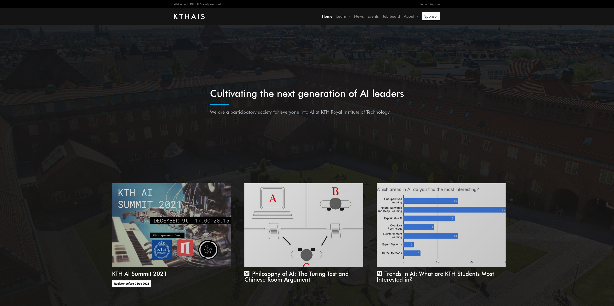

# KTHAIS website



[](https://codeclimate.com/github/kthaisociety/website/maintainability)
[](https://codeclimate.com/github/kthaisociety/website/test_coverage)
[](https://travis-ci.com/kthais/website)

:computer: Website and management system for KTHAIS

:raising_hand: Current maintainer: [@oriolclosa](https://github.com/oriolclosa)

## Project setup

Requirements: Python 3.6 or greater, virtualenv and pip.

- `git clone https://github.com/kthaisse/website && cd website`.
- `virtualenv env --python=python3`.
- `source ./env/bin/activate`.
- `pip install -r requirements.txt`.

If you run into issues with the `magic` package, try [this](https://github.com/Yelp/elastalert/issues/1927#issuecomment-425040424).

Continue with only one of the following sections depending on the purpose of the deploy.

### Local server

- `python manage.py migrate`.
- `python manage.py loaddata initial`.
- `python manage.py createsuperuser`.
- `python manage.py runserver`.

### Production server

Requirements: PostgreSQL, nginx and certbot.

#### PostgreSQL database

- `sudo -u postgres psql`.
- `CREATE DATABASE [DATABASE_NAME];`.
- `CREATE USER [DATABASE_USER] WITH PASSWORD '[DATABASE_PASSWORD]';`.
- Alter the created username for Django use.
```
ALTER ROLE [DATABASE_USER] SET client_encoding TO 'utf8';
ALTER ROLE [DATABASE_USER] SET default_transaction_isolation TO 'read committed';
ALTER ROLE [DATABASE_USER] SET timezone TO 'UTC';
```
- `GRANT ALL PRIVILEGES ON DATABASE [DATABASE_NAME] TO [DATABASE_USER];`.

#### Script files

- `cp server.sh.template server.sh`.
- Edit the `server.sh` file with the correct values of the environmental variables on each `[VARIABLE]`.
- `chmod +x server.sh`.
- `cp restart.sh.template restart.sh`.
- Edit the `restart.sh` file with the correct values of the environmental variables on each `[VARIABLE]`.
- `chmod +x restart.sh`.
- `./restart.sh`.

##### Autodeploy
- `cp deploy.sh.template deploy.sh`.
- Edit the `deploy.sh` file with the correct value for the service name.
- `chmod +x deploy.sh`.
- Add the following at the **bottom** of `/etc/sudoers`.
```
[USER] ALL=NOPASSWD: /bin/systemctl restart kthais.service
```
- Replace `[USER]` with your username.

#### Gunicorn server

- `sudo vim /etc/systemd/system/kthais.service`.
- Add the following content.
```
[Unit]
Description=KTHAIS daemon
After=network.target

[Service]
User=[USER]
Group=www-data
WorkingDirectory=[PROJECT_FOLDER]
ExecStart=[PROJECT_FOLDER]/server.sh >>[PROJECT_FOLDER]/out.log 2>>[PROJECT_FOLDER]/error.log

[Install]
WantedBy=multi-user.target
```
- Replace `[USER]` and `[PROJECT_FOLDER]` with your username and the full project location.
- `sudo systemctl start kthais && sudo systemctl enable kthais`.

#### Nginx server

- `sudo vim /etc/nginx/sites-available/kthais.com`.
- Add the following content.
```
server {
    listen 80;
    listen [::]:80;

    server_name kthais.com www.kthais.com;
    
    proxy_set_header X-Real-IP $remote_addr;

    location = /favicon.ico {
        access_log off;
        log_not_found off;
    }
    
    location /static/ {
        alias [PROJECT_FOLDER]/staticfiles/;
    }
    
    location /files/ {
        alias [PROJECT_FOLDER]/files/;
    }
    
    location / {
        include proxy_params;
        proxy_pass http://unix:[PROJECT_FOLDER]/kthais.sock;
        client_max_body_size 5M;
    }
}
```
- Replace `[PROJECT_FOLDER]` with the full project location.
- In case this is not the production site, add the following to the `location /` directive.
```
auth_basic "Protected website";
auth_basic_user_file /etc/nginx/.htpasswd;
```
- Moreover, if the previous step was followed, add this directive right after in case you will be using autodeploy.
```
location /deploy/ {
    auth_basic off;
    include proxy_params;
    proxy_pass http://unix:/home/deploy/nginx/beta.kthais.com/beta_kthais.sock;
    client_max_body_size 5M;
}
```
- Also, if you followed the previous step, run `sudo sh -c "echo -n '[USERNAME]:' >> /etc/nginx/.htpasswd"` and `sudo sh -c "openssl passwd -apr1 >> /etc/nginx/.htpasswd"` replacing `[USER]` with a username.
- `sudo ln -s /etc/nginx/sites-available/kthais.com /etc/nginx/sites-enabled/`.
- `sudo nginx -t`.
- `sudo nginx -s reload`.
- A restart of the service could be needed if nginx has recently been installed which can be done by `sudo systemctl restart nginx`.

#### HTTPS certificates

- `sudo certbot --nginx -d kthais.com -d www.kthais.com`.
- Enter `2` if requested to redirect all HTTP traffic to HTTPS (rediction of all traffic to port `80` to `443`), this will also modify the previous nginx server configuration.
- `sudo nginx -s reload`.

#### Slack bot

- Create a Slack bot on `https://api.slack.com/apps/new`.
- Activate incoming webhooks and add a webhook URL to the `#webdev-activity` channel.
- Add the bot to your workspace.
- Set the client ID, client secret and internal Slack webhook URL in `server.sh`.


## Environmental variables

- **SECRET_KEY**: Application secret (to generate one, run `os.urandom(24)`).
- **PROD_MODE**: Disable Django debug mode, should be `True` on production site.
- **PG_NAME**: PostgreSQL database name.
- **PG_USER**: PostgreSQL username.
- **PG_PWD**: PostgreSQL password.
- **PG_HOST**: PostgreSQL host (`'localhost'` by default).
- **APP_DOMAIN**: Application domain.
- **APP_IP**: Application server IP.
- **SE_URL**: Sentry post URL.
- **SE_ENV**: Sentry environment.
- **GO_ID**: Google Analytics ID.
- **GH_KEY**: GitHub webhook key.
- **GH_BRANCH**: GitHub current branch, defaults to `master`.
- **SL_ID**: Slack app client ID.
- **SL_SECRET**: Slack app client secret.
- **SL_INURL**: Internal organisation Slack webhook URL for deployments.
- **SL_TOKEN**: Slack legacy API token.
- **SL_CHANNEL_GENERAL**: Slack general channel ID.
- **MAINTENANCE_MODE**: Determines is site is under maintenance mode.
- **GO_KEY**: Google OAuth2 key.
- **GO_SECRET**: Google OAuth2 secret.

## Contribution

Please, report any incidents or questions to webdev@kthais.com.

### Style guidelines

A specific coding style is desired to keep consistency, please use [Black](https://github.com/python/black) in all your commited files. Pull Requests are required to pass all tests including the Travis CI pipeline on the repository.

### Commit message

Write it as you want, you did the work, not me. However, "Fix wrong event status due to a missing if" will always be better than "Events fixed" (doesn't apply to first commits of the repository).
